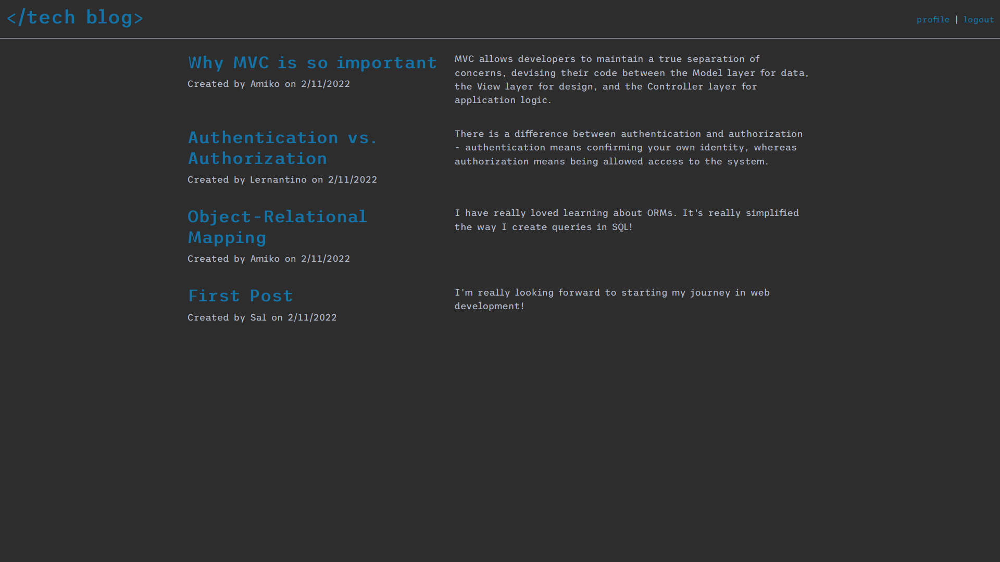

# Description

In this assignment, our task was to build a WordPress type application where users can create blogs posts and comment on other users' blog posts.

Authentication was also required, so users must either sign in or sign up before they're able to submit posts or comments.

This application uses the following npm packages:

- [bcrypt package](https://www.npmjs.com/package/bcrypt)
- [connect-session-sequelize](https://www.npmjs.com/package/connect-session-sequelize)
- [dotenv](https://www.npmjs.com/package/dotenv)
- [express](https://www.npmjs.com/package/express)
- [express-handlebars](https://www.npmjs.com/package/express-handlebars)
- [express-session](https://www.npmjs.com/package/express-session)
- [MySQL2](https://www.npmjs.com/package/mysql2)
- [Sequelize](https://www.npmjs.com/package/sequelize)

HTML | CSS | JavaScript | Node.js | Handlebars.js | Sequelize | MySQL

# Screenshot

# Link

https://techblog21222.herokuapp.com/
